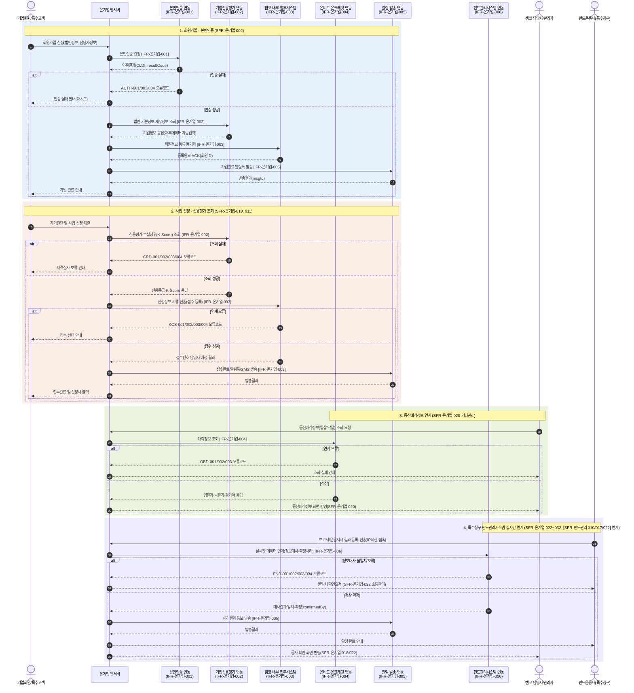

```mermaid
sequenceDiagram
    autonumber
    actor 기업회원 as 기업회원/특수고객
    participant OnCorp as 온기업 웹서버
    participant AuthGW as 본인인증 연동<br/>(IFR-온기업-001)
    participant CreditAPI as 기업신용평가 연동<br/>(IFR-온기업-002)
    participant KamcoCore as 캠코 내부 업무시스템<br/>(IFR-온기업-003)
    participant OnbidCredit as 온비드·온크레딧 연동<br/>(IFR-온기업-004)
    participant NotiGW as 알림 발송 연동<br/>(IFR-온기업-005)
    participant FundSys as 펀드관리시스템 연동<br/>(IFR-온기업-006)
    actor 관리자 as 캠코 담당자/관리자
    actor 펀드운용사 as 펀드운용사(특수창구)

    rect rgb(230,241,251)
    Note over 기업회원,NotiGW: 1. 회원가입 · 본인인증 (SFR-온기업-002)
    기업회원->>OnCorp: 회원가입 신청(법인정보, 담당자정보)
    OnCorp->>AuthGW: 본인인증 요청 [IFR-온기업-001]
    AuthGW-->>OnCorp: 인증결과(CI/DI, resultCode)
    alt 인증 실패
        AuthGW-->>OnCorp: AUTH-001/002/004 오류코드
        OnCorp-->>기업회원: 인증 실패 안내(재시도)
    else 인증 성공
        OnCorp->>CreditAPI: 법인 기본정보·재무정보 조회 [IFR-온기업-002]
        CreditAPI-->>OnCorp: 기업정보 응답(재무데이터 자동입력)
        OnCorp->>KamcoCore: 회원정보 등록 동기화 [IFR-온기업-003]
        KamcoCore-->>OnCorp: 등록완료 ACK(회원ID)
        OnCorp->>NotiGW: 가입완료 알림톡 발송 [IFR-온기업-005]
        NotiGW-->>OnCorp: 발송결과(msgId)
        OnCorp-->>기업회원: 가입 완료 안내
    end
    end

    rect rgb(250,238,231)
    Note over 기업회원,NotiGW: 2. 사업 신청 · 신용평가 조회 (SFR-온기업-010, 011)
    기업회원->>OnCorp: 자가진단 및 사업 신청 제출
    OnCorp->>CreditAPI: 신용평가·부실징후(K-Score) 조회 [IFR-온기업-002]
    alt 조회 실패
        CreditAPI-->>OnCorp: CRD-001/002/003/004 오류코드
        OnCorp-->>기업회원: 자격심사 보류 안내
    else 조회 성공
        CreditAPI-->>OnCorp: 신용등급·K-Score 응답
        OnCorp->>KamcoCore: 신청정보·서류 전송(접수 등록) [IFR-온기업-003]
        alt 연계 오류
            KamcoCore-->>OnCorp: KCS-001/002/003/004 오류코드
            OnCorp-->>기업회원: 접수 실패 안내
        else 접수 성공
            KamcoCore-->>OnCorp: 접수번호·담당자 배정 결과
            OnCorp->>NotiGW: 접수완료 알림톡/SMS 발송 [IFR-온기업-005]
            NotiGW-->>OnCorp: 발송결과
            OnCorp-->>기업회원: 접수완료 및 신청서 출력
        end
    end
    end

    rect rgb(234,243,222)
    Note over 관리자,OnbidCredit: 3. 동산매각정보 연계 (SFR-온기업-020 기타관리)
    관리자->>OnCorp: 동산매각정보(입찰/낙찰) 조회 요청
    OnCorp->>OnbidCredit: 매각정보 조회 [IFR-온기업-004]
    alt 연계 오류
        OnbidCredit-->>OnCorp: OBD-001/002/003 오류코드
        OnCorp-->>관리자: 조회 실패 안내
    else 정상
        OnbidCredit-->>OnCorp: 입찰가·낙찰가·평가액 응답
        OnCorp-->>관리자: 동산매각정보 화면 반영(SFR-온기업-020)
    end
    end

    rect rgb(238,237,254)
    Note over 펀드운용사,FundSys: 4. 특수창구 펀드관리시스템 실시간 연계 (SFR-온기업-022~032, [SFR-펀드관리-010/017/022] 연계)
    펀드운용사->>OnCorp: 보고서/운용지시 결과 등록·전송(IP제한 접속)
    OnCorp->>FundSys: 실시간 데이터 연계(정보대사·확정처리) [IFR-온기업-006]
    alt 정보대사 불일치/오류
        FundSys-->>OnCorp: FND-001/002/003/004 오류코드
        OnCorp-->>펀드운용사: 불일치 확인요청 (SFR-온기업-032 소통관리)
    else 정상 확정
        FundSys-->>OnCorp: 대사결과 일치·확정(confirmedBy)
        OnCorp->>NotiGW: 처리결과 통보 발송 [IFR-온기업-005]
        NotiGW-->>OnCorp: 발송결과
        OnCorp-->>펀드운용사: 확정 완료 안내
        OnCorp-->>관리자: 공사 확인 화면 반영(SFR-온기업-018/022)
    end
    end
```